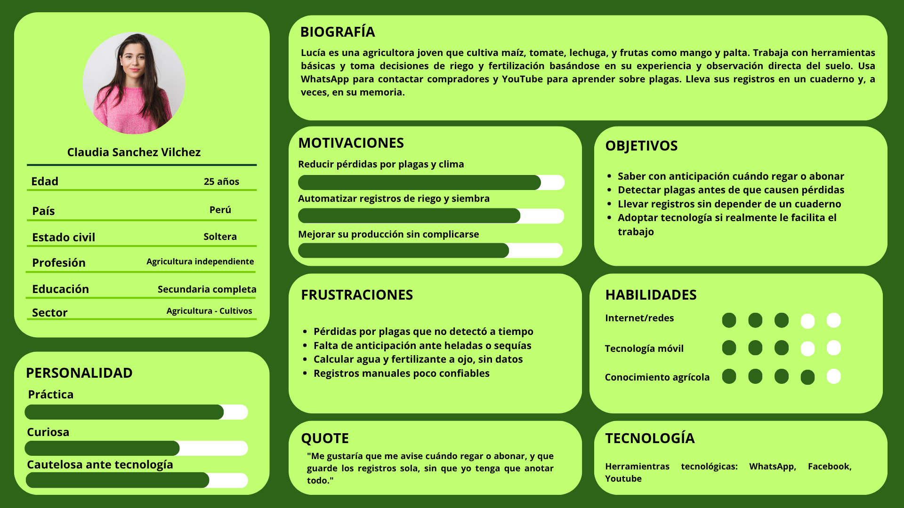
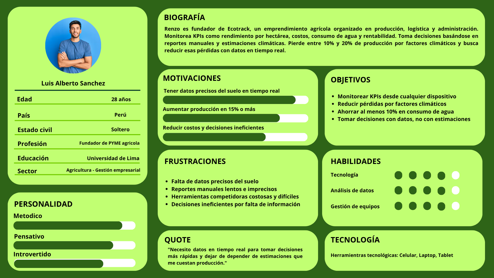

## 2.3. Needfinding

### 2.3.1. User Personas

Los User Persona son perfiles que representan a nuestros usuarios principales, creados a partir de información real recogida en entrevistas. Esta herramienta nos ayuda a entender sus objetivos, dificultades y necesidades clave. En AgroTrack, estos perfiles permiten diseñar soluciones más adecuadas a las expectativas tanto de los artistas como de sus posibles clientes.

**User persona - Agricultores**

 

**User persona - Empresarios Agrícolas**

