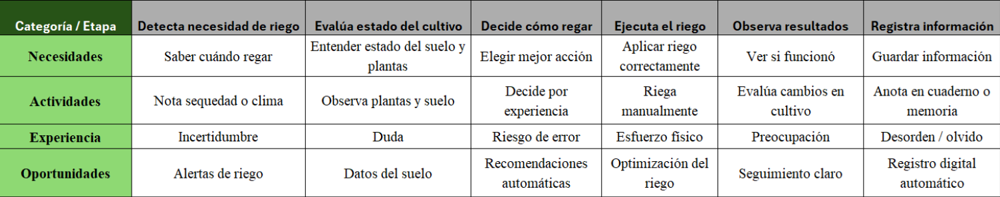
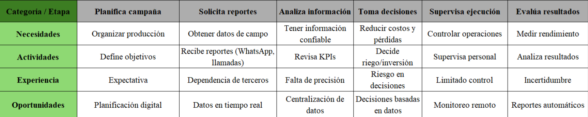

### 2.3.3. User Journey Mapping

En esta sección se presentan los User Journey Mapping de los dos segmentos identificados agricultores y empresarios agrícolas. Se describe el recorrido actual As-Is que siguen para gestionar sus cultivos y tomar decisiones de riego, desde la identificación de una necesidad hasta la evaluación de resultados. Estos journeys reflejan las actividades, necesidades y dificultades que enfrentan actualmente sin el uso de una solución tecnológica como AgroTrack.

**User Journey Mapping - Agricultor**

**User Journey Mapping - Agricultor**
