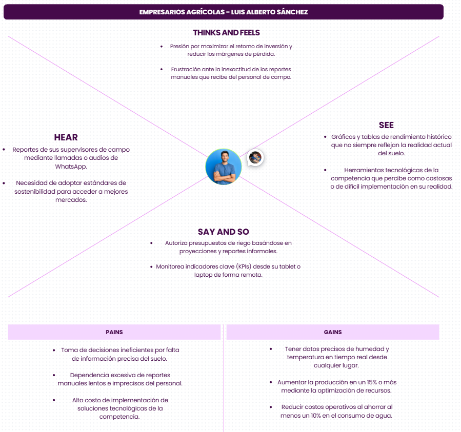

### 2.3.4. Empathy Mapping

En esta sección se presentan los Empathy Maps desarrollados para profundizar en la comprensión de los segmentos objetivo de AgroTrack. Este análisis permite identificar los dolores y las motivaciones reales de los usuarios finales.

**Empathy Mapping - Agricultor**

**Empathy Mapping - Empresario Agricola**

