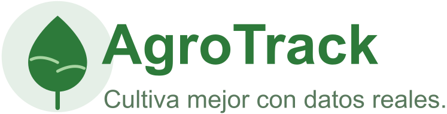

### 4.1.1. General Style Guidelines

#### Branding
* **Nombre del producto:** AgroTrack
* **Tagline:** *Cultiva mejor con datos reales.*
* **Identidad visual:** AgroTrack busca transmitir confianza, cercanía y modernidad accesible para el agricultor peruano. La identidad visual combina elementos naturales (tierra, agua, cultivos) con una estética limpia y funcional, adaptada a usuarios con poca experiencia tecnológica.
* **Logo:** El logotipo está compuesto por un ícono que representa una hoja o planta estilizada acompañada del nombre "AgroTrack" en tipografía sans-serif legible, reflejando el equilibrio entre el campo y la tecnología.
* **Valores visuales:** Confianza, simplicidad, eficiencia y cercanía con el campo.

---

#### Typography
* **Tipografía principal:** **Inter** (sans-serif), elegida por su alta legibilidad en pantallas, especialmente en dispositivos móviles con conectividad limitada. Usada en títulos y encabezados.
* **Tipografía secundaria:** **Roboto** (sans-serif), empleada en cuerpos de texto, etiquetas y elementos de interfaz por su claridad en tamaños pequeños.

**Jerarquía tipográfica:**
* **Títulos (H1):** 32–40 px
* **Subtítulos (H2):** 24–28 px
* **Texto base:** 16 px
* **Botones y etiquetas:** 14–16 px, en mayúsculas o negrita según jerarquía.

> **Principio aplicado:** Legibilidad máxima para usuarios con baja experiencia tecnológica, sin recursos decorativos que dificulten la lectura rápida en campo.

---

#### Colors
La paleta cromática busca evocar el entorno natural del campo peruano (tierra, vegetación y agua) combinada con tonos neutros que transmiten confianza y claridad de información.

La tabla a continuación resume la paleta con su aplicación principal:

| Tipo | Nombre | Código | Aplicación principal |
| :--- | :--- | :--- | :--- |
| **Primario** | Verde campo | `#2D7A3A` | Botones principales, íconos activos, encabezados |
| **Secundario** | Verde suave | `#5DAB72` | Estados positivos, confirmaciones, alertas de riego OK |
| **Complementario** | Azul agua | `#4A90D9` | Indicadores de humedad, datos del suelo, gráficos |
| **Neutro claro** | Fondo tierra | `#F5F0E8` | Fondos de páginas, tarjetas de parcela |
| **Neutro oscuro** | Texto oscuro | `#2C3E2D` | Texto principal y encabezados |
| **Borde/divisor** | Verde pálido | `#D9EDD9` | Líneas, contenedores, separadores |

*Figura 14. Paleta de colores institucional de AgroTrack. Nota. Elaboración propia.*

---

#### Spacing y Layout
* **Márgenes y paddings:** Uniformes (mínimo 16 px).
* **Bordes:** Redondeados entre **4–8 px** para suavizar la interfaz y dar sensación de accesibilidad.
* **Grillas:** Uso de sistema de grillas (*grid system*) adaptable a distintos tamaños de pantalla.
* **Distribución:**
    * **Mobile:** Una sola columna.
    * **Desktop:** Dos o tres columnas para optimizar legibilidad y ritmo visual.
* **Interactividad:** Especial atención al tamaño de los elementos interactivos (botones, campos) para facilitar el uso táctil en campo.

---

#### Tone of Voice
* **Dimensión tonal:** Cercano, claro y alentador.
* **Lenguaje:** Directo, sencillo y sin tecnicismos, hablando el mismo idioma que el agricultor.
* **Estilo comunicativo:** Práctico y orientado a la acción, generando confianza inmediata desde el primer uso.

**Ejemplos de tono de acción:**
* *"Tu parcela necesita riego hoy."*
* *"Registra tu cultivo en segundos."*
* *"Recibe alertas antes de que llegue la helada."*