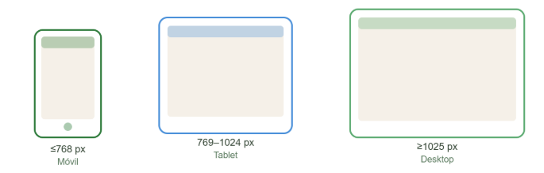

### 4.1.2. Web Style Guidelines

#### Diseño Responsivo

* **Breakpoints definidos:**
    * Móvil: ≤768 px
    * Tablet: 769–1024 px
    * Desktop: ≥1025 px

*Figura 15. Tamaños de Breakpoints definidos para AgroTrack. Nota. Elaboración propia.*

* **Comportamiento adaptativo:**
    * En móvil, se prioriza la visualización vertical con menú hamburguesa y tarjetas de parcelas apiladas.
    * En desktop, se emplea una distribución horizontal con estructura de dos o tres columnas.
    * El diseño mantiene jerarquía visual y lenguaje cromático consistente en todos los dispositivos.

---

#### Componentes Web

* **Botones (CTAs):**
    * **Primario:** Fondo verde `#2D7A3A`, texto blanco, borde redondeado (8–12 px).
    * **Secundario:** Fondo blanco, borde verde `#5DAB72`, texto verde.
    * **Estados:** *hover* (tono más oscuro), *active* (sombra ligera), *disabled* (opacidad reducida).

*Figura 16. Variantes de botones CTA de AgroTrack. Nota. Elaboración propia.*

* **Formularios:**
    * Campos con bordes finos y feedback visual al error o validación.
    * Etiquetas visibles y mensajes de error en texto rojo o ícono de advertencia.
    * Campos de ingreso de datos del suelo (humedad, temperatura) con validación de rango inmediata.

* **Navegación:**
    * Barra superior fija (*sticky header*) con logo, enlaces principales y CTA de registro.
    * Menú desplegable para secciones secundarias.
    * En móvil, menú tipo hamburguesa con ícono fácilmente reconocible.

* **Cards (tarjetas de parcela):**
    * Secciones por parcela con nombre, cultivo activo, estado del suelo e última alerta.
    * Bordes suaves, sin sombra pesada, márgenes consistentes de 16 px.
    * Indicador de estado del suelo con color semántico: verde (normal), amarillo (atención), rojo (crítico).

---

#### Interacción y Accesibilidad

* **Animaciones:** Transiciones suaves de 0.2 s para interacciones con botones o cambios de vista.
* **Indicadores de carga:** Ícono circular o barra de progreso visible durante procesos de espera.
* **Accesibilidad (WCAG 2.1):**
    * Contraste mínimo AA en texto e íconos.
    * Navegación mediante teclado.
    * Etiquetas alternativas (*alt text*) en imágenes y gráficos de parcelas.
* **Microinteracciones:** Animaciones sutiles al hacer clic y retroalimentación visual al confirmar una acción (p.ej. registro de riego exitoso).