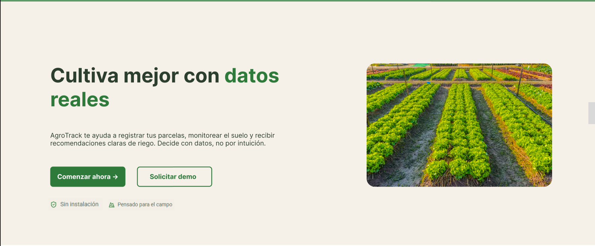

### 4.2.5 Navigation Systems

Para el sistema de navegación otorgamos libertad y facilidad al usuario dentro de la plataforma con diversas interfaces de navegación:

***PRIMERA NAVEGACIÓN:*** Acceso a apartados para cada tipo de usuario y herramientas de registro e inicio de sesión. Este navegador global se encuentra en la parte superior de la pantalla permitiendo que el usuario pueda acceder en todo momento a las funciones principales del sitio sin la necesidad de scrollear.

*Fuente: Propia.*

***SEGUNDA NAVEGACIÓN:*** Pie de página con información adicional. Este pie de página organiza enlaces relevantes tanto para el artista como para el cliente y además ayuda al usuario que llegó hasta el final del sitio a seguir navegando sin tener que volver al inicio.

*Fuente: Propia.*

***TERCERA NAVEGACIÓN:*** Sección de registro continúa al apartado de contenido principal. Esta sección de registro que va luego de que el usuario haya visto el contenido principal del sitio, le ayuda a tomar decisiones como agricultor.

*Fuente: Propia.*