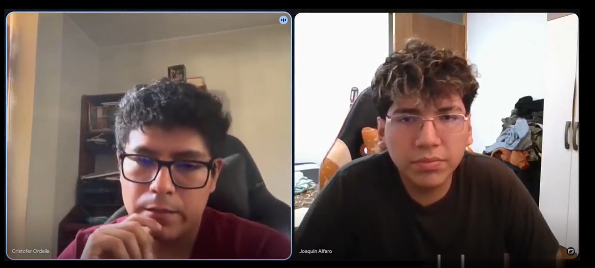
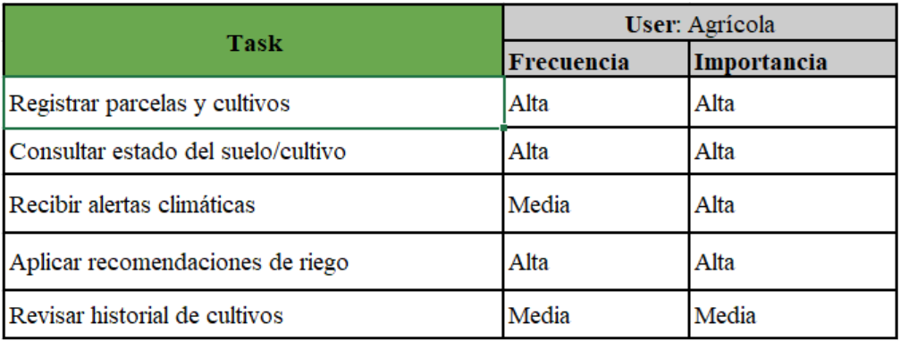
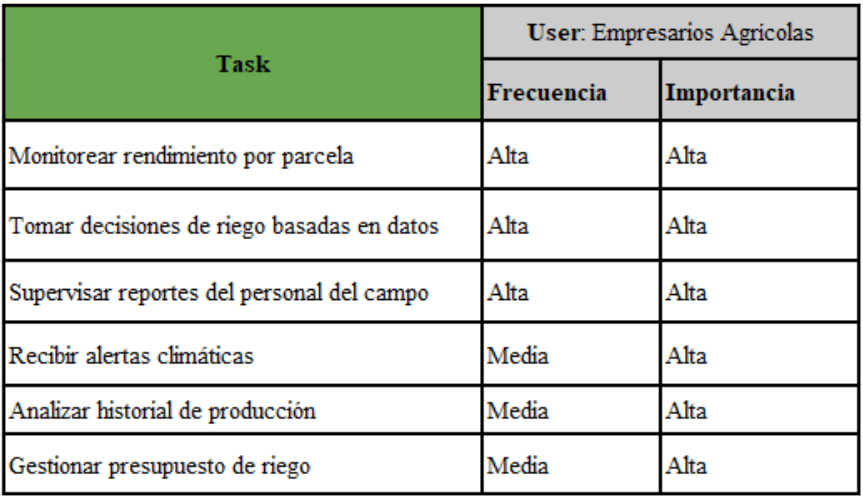
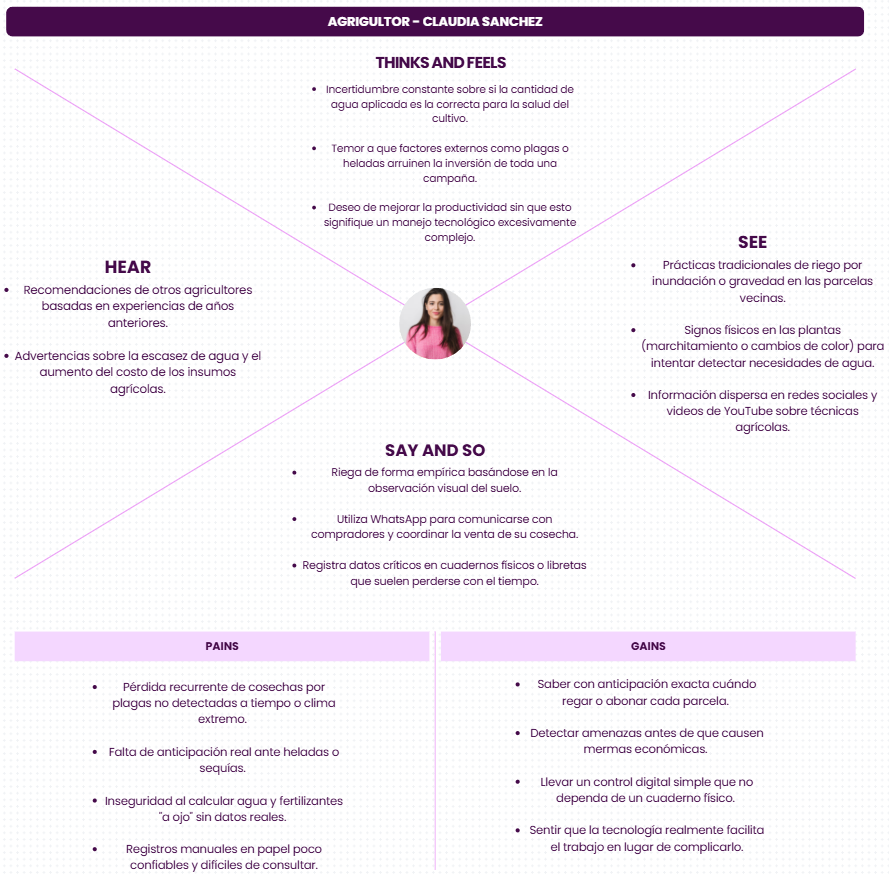
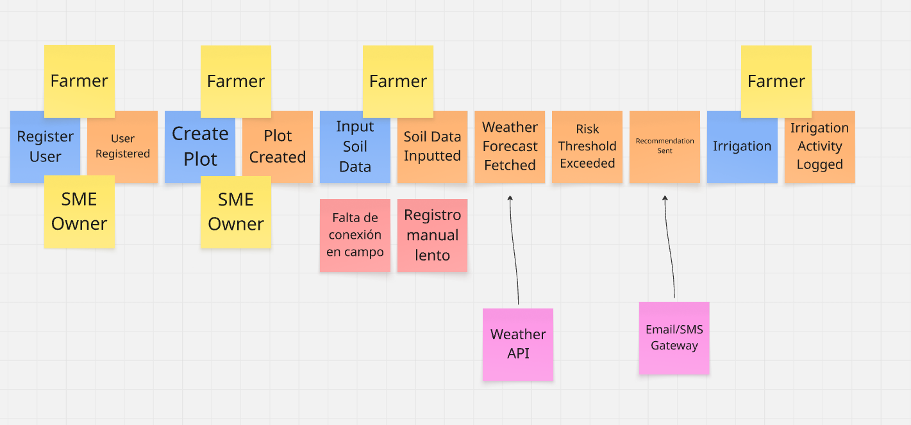

  

# Capítulo II: Requirements Elicitation & Analysis

## 2.1. Competidores

### 2.1.1. Análisis Competitivo

A continuación se presenta el análisis competitivo de AgroTrack frente a
las principales soluciones digitales existentes en el mercado agrícola.

**Competitive Analysis Landscape**

**¿Por qué llevar a cabo este análisis?**

Realizamos este análisis para identificar las fortalezas y debilidades
de los competidores directos e indirectos de AgroTrack, con el fin de
definir una propuesta de valor diferenciada y estrategias que nos
permitan captar el segmento de agricultores pequeños y empresarios
agrícolas en el Perú.

------------------------------------------------------------------------

## Tabla de Análisis Competitivo

| | **AgroTrack** | **CropX** | **Trimble Ag** | **Agroptima** |
|---|---|---|---|---|
| **Logo** | *(Andes Smart)* | *(CropX Inc.)* | *(Trimble Inc.)* | *(Agroptima SL)* |
| **Perfil General** | Plataforma web de monitoreo agrícola orientada a pequeños agricultores y PYMEs del Perú, con alertas climáticas y recomendaciones de riego. | Solución IoT de sensores de suelo para monitoreo de humedad y temperatura, enfocada en grandes operaciones agrícolas. | Suite completa de gestión agrícola con GPS, maquinaria y análisis de datos para grandes productores. | App de gestión de cultivos para pequeños y medianos agricultores en España y Latinoamérica. |
| **Ventaja Competitiva** | Adaptado al contexto peruano, bajo costo de entrada, interfaz simple en español para usuarios con poca experiencia tecnológica. | Alta precisión de datos de suelo en tiempo real mediante sensores físicos instalados en campo. | Ecosistema integrado de hardware y software con décadas de experiencia en el sector. | Facilidad de uso y orientación a pequeños productores; registro de actividades y cuaderno de campo digital. |
| **Mercado Objetivo** | Agricultores pequeños y empresarios agrícolas PYMEs en Perú (20-75 años). | Grandes productores agrícolas en EE.UU., Australia, Israel y mercados emergentes. | Grandes y medianas empresas agroindustriales a nivel global. | Pequeños y medianos agricultores en España, México, Chile, Colombia y Perú. |
| **Estrategias de Marketing** | Redes sociales, landing page con demostración del producto, alianzas con asociaciones agrícolas locales. | Venta directa B2B, ferias agrícolas internacionales, demostraciones técnicas en campo. | Fuerza de ventas corporativa, distribuidores especializados, presencia en ferias globales (Agritechnica). | Marketing digital, prueba gratuita, modelo freemium con planes de pago por funcionalidades. |
| **Productos & Servicios** | Panel de control de parcelas, alertas climáticas, recomendaciones de riego, historial digital de cultivos. | Sensores de humedad/temperatura de suelo, plataforma de análisis de datos, informes predictivos. | Software de planificación de cultivos, gestión de maquinaria, mapas de rendimiento, telemetría GPS. | Cuaderno de campo digital, registro de actividades, control de fitosanitarios, análisis de costes. |
| **Precios & Costos** | Por definir (modelo freemium orientado a bajo costo para el mercado peruano). | Desde ~$500 USD por kit de sensor + suscripción mensual. | Licencias corporativas desde cientos de dólares anuales; alto costo de implementación. | Plan gratuito limitado; planes de pago desde ~10-30 EUR/mes. |
| **Canales de Distribución** | Web app directa, WhatsApp y redes sociales como canal de soporte y adquisición. | Venta directa, distribuidores agrícolas, integradores de tecnología. | Distribuidores autorizados Trimble, integradores de soluciones agro. | App Store, Google Play, sitio web oficial. |

## Análisis FODA de AgroTrack

| | **Fortalezas** | **Debilidades** |
|---|---|---|
| | - Diseñado específicamente para el contexto peruano. | - Sin datos históricos propios ni base de usuarios establecida. |
| | - Interfaz simple en español, orientada a usuarios con bajo nivel tecnológico. | - Dependencia de conectividad a internet en zonas rurales con baja cobertura. |
| | - Bajo costo de entrada frente a soluciones internacionales. | - Equipo pequeño con recursos limitados para escalar rápidamente. |
| | - Panel visual de parcelas y alertas climáticas como diferenciador inmediato. | - Aún sin integración IoT real (entrada manual de datos en la fase inicial). |
| | **Oportunidades** | **Amenazas** |
| | - Creciente digitalización del agro peruano impulsada por el Estado y ONG. | - Competidores internacionales con mayor respaldo financiero y tecnológico. |
| | - Bajo nivel de penetración de soluciones tecnológicas en el agro peruano. | - Agroptima ya tiene presencia en Latinoamérica con producto maduro. |
| | - Posibilidad de alianzas con el Ministerio de Agricultura (MIDAGRI) y ANA. | - Posible desconfianza del agricultor tradicional hacia herramientas digitales. |
| | - Expansión a otros países andinos con problemática similar (Bolivia, Ecuador). | - Riesgo de copia rápida de funcionalidades por startups con más recursos. |

### 2.1.2. Estrategias y Tácticas frente a Competidores

Frente al panorama competitivo analizado, AgroTrack adoptará las
siguientes estrategias:

**Estrategia de Diferenciación por Contexto Local**

A diferencia de CropX y Trimble Ag, cuyas soluciones están diseñadas
para grandes productores con alto poder adquisitivo, AgroTrack se
posiciona como la alternativa accesible y adaptada al agricultor
peruano. El uso de lenguaje sencillo, la interfaz en español y el modelo
de bajo costo son barreras de entrada intencionales para captar al
segmento desatendido.

**Estrategia de Penetración con Modelo Freemium**

Al igual que Agroptima, AgroTrack ofrecerá acceso gratuito a
funcionalidades básicas (registro de parcelas, alertas climáticas) para
reducir la fricción de adopción. Las funcionalidades avanzadas
(historial analítico, recomendaciones personalizadas) estarán
disponibles en planes de pago asequibles.

**Estrategia de Validación Temprana con Usuarios**

Antes de competir directamente con plataformas maduras, AgroTrack
priorizará entrevistas de Needfinding y pruebas de prototipo con
agricultores locales. Esto permite iterar el producto rápidamente con
retroalimentación real antes de escalar, reduciendo el riesgo de
construir funcionalidades que el usuario no adopte.

**Táctica de Alianzas Institucionales**

Se explorarán alianzas con el MIDAGRI, la ANA (Autoridad Nacional del
Agua), y asociaciones de productores regionales para ganar credibilidad
y acceso a base de usuarios sin depender exclusivamente de marketing
digital.

**Táctica de Contenido Educativo**

Dado que el agricultor objetivo puede ser reticente a adoptar
tecnología, AgroTrack desarrollará contenido educativo (tutoriales en
video, guías en WhatsApp) que reduzca la curva de aprendizaje y genere
confianza en la plataforma antes de la primera descarga.

## 2.2. Entrevistas

### 2.2.1. Diseño de entrevistas

El objetivo de estas entrevistas es validar los puntos de dolor
relacionados con la gestión del riego y la disposición al uso de
herramientas digitales. Se han diseñado cuestionarios específicos para
cada segmento objetivo.

- Preguntas para los agricultores:

1.  ¿Qué cultivos maneja actualmente y qué herramientas o maquinaria
    utiliza para su mantenimiento diario?
2.  ¿Qué aplicaciones utiliza con más frecuencia en su celular y para
    qué fines (comunicación, entretenimiento, trabajo)?
3.  ¿Cómo determina hoy, paso a paso, que una parcela necesita riego sin
    usar sensores?
4.  ¿Cuál ha sido su mayor frustración relacionada con la pérdida de una
    cosecha en el último año?
5.  ¿Cómo calcula la cantidad de agua o fertilizante que debe comprar
    para una temporada?
6.  ¿A quién acude o qué medios consulta cuando tiene una duda técnica
    sobre sus cultivos?
7.  ¿Cómo lleva el registro de las fechas de siembra y cosecha
    actualmente (papel, memoria, otros)?
8.  Ante una alerta de helada o sequía, ¿qué acciones preventivas suele
    tomar y con cuánto tiempo de anticipación?
9.  Si tuviera una herramienta que automatizara sus registros, ¿qué es
    lo primero que le gustaría que hiciera por usted?
10. ¿Qué le convencería de que usar una plataforma web es mejor que
    seguir su intuición de años?

- Preguntas para los empresarios agricolas:

1.  ¿Cómo está estructurada su empresa y qué metas de producción tiene
    para este ciclo académico/fiscal?
2.  ¿Qué dispositivos (Laptop, Tablet, Smartphone) considera
    indispensables para gestionar su negocio?
3.  ¿Qué indicadores de rendimiento (KPIs) monitorea para saber si su
    inversión en cultivos es rentable?
4.  ¿De qué manera la falta de datos precisos sobre el suelo ha afectado
    sus costos de operación anteriormente?
5.  ¿En qué información se basa para autorizar el presupuesto de riego y
    mantenimiento de la temporada?
6.  ¿Qué herramientas digitales conoce que use su competencia y qué
    opina de ellas?
7.  ¿Qué porcentaje de su producción se pierde usualmente por factores
    climáticos y cómo intenta reducirlo?
8.  ¿Cómo recibe los reportes del estado de los cultivos por parte del
    personal de campo?
9.  ¿Qué valor le daría a tener datos en tiempo real de sus campos sin
    depender del ingreso manual de su personal?
10. ¿Qué ahorro mínimo en costos de agua o mejora en la cosecha
    esperaría para considerar que esta plataforma es un éxito?

### 2.2.2. Registro de entrevistas

**Entrevista N° 1**

| **Nombres y apellidos:** Walter Medina Macedo | **Edad:** 26 | **Distrito:** Chachapoyas, Amazonas |
|---|---|---|

| **URL:** [Entrevista - 1er seg obj - Miler Rodriguez 1.mp4](https://upcedupe-my.sharepoint.com/:v:/g/personal/u20241a827_upc_edu_pe/IQA7Y8rY1pOWRIXG-iCyIG6oAZ2IIM0sMFGl20NuTco6qfI?e=YgDGTl&nav=eyJyZWZlcnJhbEluZm8iOnsicmVmZXJyYWxBcHAiOiJTdHJlYW1XZWJBcHAiLCJyZWZlcnJhbFZpZXciOiJTaGFyZURpYWxvZy1MaW5rIiwicmVmZXJyYWxBcHBQbGF0Zm9ybSI6IldlYiIsInJlZmVycmFsTW9kZSI6InZpZXcifX0%3D) | **Inicio de la entrevista:** 00:00 | **Duración:** 6:34 min |
|---|---|---|

**Resumen:** Walter, de 26 años y estudiante de Ingeniería de Sistemas, proviene de una familia dedicada al cultivo de café. Utilizan herramientas como motoguadañas, fumigadoras y mano de obra para el mantenimiento. Gestiona la comunicación con WhatsApp y usa Excel para organizar costos, mientras que los registros de cultivo se llevan principalmente en papel. Las decisiones de riego se toman de forma manual, observando el estado de las plantas. Ha sufrido pérdidas por plagas y no cuenta con medidas preventivas sólidas ante cambios climáticos. Se apoya en técnicos agrícolas y programas del Estado para asesoría. Le gustaría una herramienta que mida la humedad del suelo, automatice registros y genere reportes, siempre que sea fácil de usar y más eficiente que sus métodos actuales.

---

**Entrevista N° 2**

| **Nombres y apellidos:** Lucia Alarcon | **Edad:** 25 | **Distrito:** Cumba, Amazonas |
|---|---|---|

| **URL:** [Entrevista - 1er seg obj - Eder Quispe.mp4](https://upcedupe-my.sharepoint.com/:v:/g/personal/u202324623_upc_edu_pe/IQDidGgCC_E9QIX1GOCVgAAOAVuK1pcpOl7TY5HJ6ZAcxlY?nav=eyJyZWZlcnJhbEluZm8iOnsicmVmZXJyYWxBcHAiOiJTdHJlYW1XZWJBcHAiLCJyZWZlcnJhbFZpZXciOiJTaGFyZURpYWxvZy1MaW5rIiwicmVmZXJyYWxBcHBQbGF0Zm9ybSI6IldlYiIsInJlZmVycmFsTW9kZSI6InZpZXcifX0%3D&e=MifF7G) | **Inicio de la entrevista:** 00:00 | **Duración:** 4:12 |
|---|---|---|

**Resumen:** Lucía, de 25 años y estudiante de Psicología, es una agricultora que cultiva maíz y hortalizas como tomate y lechuga. Utiliza herramientas básicas como pala, azadón y fumigadora manual, y ocasionalmente alquila motocultores para la preparación de tierra. Gestiona la comunicación con WhatsApp para contactar compradores y otros agricultores, mientras que usa Facebook y YouTube para obtener información agrícola y aprender sobre plagas. Los registros de siembra y cosecha los lleva principalmente en un cuaderno, con ocasionales apuntes en memoria. Las decisiones de riego se toman de forma manual, observando la sequedad del suelo y el estado de las plantas. Ha sufrido pérdidas significativas por plagas que no detectó a tiempo. Le gustaría una herramienta que automatice los registros de riego, siembra y fertilización, y se convencería de adoptarla si demuestra mejorar la producción, reducir pérdidas y sea fácil de usar.

---

**Entrevista N° 3**

| **Nombres y apellidos:** Luz Mamani | **Edad:** 24 | **Distrito:** Arequipa, Perú |
|---|---|---|

| **URL:** [Entrevista - 1er seg obj - Eder Quispe 1.mp4](https://upcedupe-my.sharepoint.com/:v:/g/personal/u202324623_upc_edu_pe/IQD12rOS9xukQKDOJngTl7w0Aa2RYMlbZo7YzQXCsVdR7tw?nav=eyJyZWZlcnJhbEluZm8iOnsicmVmZXJyYWxBcHAiOiJTdHJlYW1XZWJBcHAiLCJyZWZlcnJhbFZpZXciOiJTaGFyZURpYWxvZy1MaW5rIiwicmVmZXJyYWxBcHBQbGF0Zm9ybSI6IldlYiIsInJlZmVycmFsTW9kZSI6InZpZXcifX0%3D&e=u8jJHb) | **Inicio de la entrevista:** 00:00 | **Duración:** 2:57 |
|---|---|---|

**Resumen:** Luz, de 24 años y estudiante de Psicología, es una agricultora que se dedica al cultivo de frutas como mango, palta y limón. Utiliza herramientas básicas como pala, machete, tijeras para podar y ocasionalmente una motobomba para el riego. Gestiona la comunicación con WhatsApp para contactar otros agricultores y compradores, mientras que usa Facebook y YouTube para obtener información y aprender sobre agricultura. Los registros de siembra y cosecha los lleva principalmente en un cuaderno, aunque también confía en su memoria. Ha sufrido pérdidas significativas por calor extremo y falta de agua. Ante alertas de heladas o sequía, intenta adelantar el riego o proteger las plantas, aunque reconoce que la falta de tiempo anticipado dificulta tomar medidas preventivas efectivas. Le gustaría una herramienta que le avise automáticamente cuándo regar o abonar y que guarde registros sin anotar manualmente, siempre que sea fácil de usar y no consuma mucho internet.

---

**Entrevista N° 4**

| **Nombres y apellidos:** Renzo Quispe Mamani | **Edad:** 28 | **Distrito:** Lima, Perú |
|---|---|---|

| **URL:** [Entrevista - 2do seg obj - Miler Rodriguez.mp4](https://upcedupe-my.sharepoint.com/:v:/g/personal/u20241a827_upc_edu_pe/IQBpPA9-AgKuTYSsa7rfQ_3NAWt06SZe20fFxPk2vz_tj6o?e=cWepbS&nav=eyJyZWZlcnJhbEluZm8iOnsicmVmZXJyYWxBcHAiOiJTdHJlYW1XZWJBcHAiLCJyZWZlcnJhbFZpZXciOiJTaGFyZURpYWxvZy1MaW5rIiwicmVmZXJyYWxBcHBQbGF0Zm9ybSI6IldlYiIsInJlZmVycmFsTW9kZSI6InZpZXcifX0%3D) | **Inicio de la entrevista:** 00:00 | **Duración:** 4:16 min |
|---|---|---|

**Resumen:** Renzo Sebastián Quispe Mamani, de 28 años y egresado de la Universidad de Lima, es fundador de Ecotrack, un emprendimiento agrícola organizado en producción, logística y administración. Su objetivo es aumentar la producción en un 15% manteniendo la calidad. Utiliza celular, laptop y tablet para gestionar su negocio y monitorea KPIs como rendimiento por hectárea, costos, consumo de agua, pérdidas y rentabilidad. Enfrenta problemas por la falta de datos precisos del suelo, lo que genera decisiones ineficientes y mayores costos. Actualmente se basa en experiencia, reportes manuales y estimaciones climáticas. Pierde entre 10% y 20% de producción por factores climáticos y considera clave contar con datos en tiempo real. Espera como mínimo un 10% de ahorro de agua o un 15% de aumento en la producción para considerar exitosa una solución tecnológica.

---

**Entrevista N° 5**

| **Nombres y apellidos:** Sofia Martinez | **Edad:** 26 | **Distrito:** Lima, Perú |
|---|---|---|

| **URL:** [Entrevista - 2do seg obj - Eder Quispe.mp4](https://upcedupe-my.sharepoint.com/:v:/g/personal/u202324623_upc_edu_pe/IQBALW19b-Z_SIeQbTrZUZ1fAUpuk-2I7KrrwWEJK9rsHi0?nav=eyJyZWZlcnJhbEluZm8iOnsicmVmZXJyYWxBcHAiOiJTdHJlYW1XZWJBcHAiLCJyZWZlcnJhbFZpZXciOiJTaGFyZURpYWxvZy1MaW5rIiwicmVmZXJyYWxBcHBQbGF0Zm9ybSI6IldlYiIsInJlZmVycmFsTW9kZSI6InZpZXcifX0%3D&e=lvIQ03) | **Inicio de la entrevista:** 00:00 | **Duración:** 3:58 |
|---|---|---|

**Resumen:** Sofía, de 26 años y estudiante de Psicología, es una joven empresaria agrícola en la empresa Viru. La empresa está estructurada en tres áreas principales: producción, logística y administración, con supervisores de campo y personal técnico. Su meta para este ciclo es aumentar la producción un 15% y reducir costos mediante el uso de tecnología. Monitorea indicadores clave como rendimiento por hectárea, costos de riego, porcentajes de pérdidas y calidad del cultivo. Autoriza presupuestos basándose en condiciones climáticas, historial de producción y experiencia del personal. La falta de datos precisos sobre el suelo ha generado uso innecesario de fertilizantes y menor productividad. Pierde entre 10% y 30% de su producción por factores climáticos. Actualmente recibe reportes mediante llamadas, WhatsApp y reportes manuscritos del personal de campo. Consideraría exitosa una plataforma que reduzca 15% el consumo de agua, aumente 10% la producción y disminuya pérdidas en un 10%.

---

**Entrevista N° 6**

| **Nombres y apellidos:** Cristofer Ordalla| **Edad:** 29 | **Distrito:** Piura, Perú |
|---|---|---|

| **URL:**  [Entrevista - 2do seg obj - Joaquin Alfaro](https://upcedupe-my.sharepoint.com/:v:/g/personal/u20241a267_upc_edu_pe/IQDZaXNASBtjSqMs6HKMKmKSAVUVdK2ce6BrVstfl1zh2gk?e=CN8ApV&nav=eyJyZWZlcnJhbEluZm8iOnsicmVmZXJyYWxBcHAiOiJTdHJlYW1XZWJBcHAiLCJyZWZlcnJhbFZpZXciOiJTaGFyZURpYWxvZy1MaW5rIiwicmVmZXJyYWxBcHBQbGF0Zm9ybSI6IldlYiIsInJlZmVycmFsTW9kZSI6InZpZXcifX0%3D) |**Inicio de la entrevista:** 00:00 | **Duración:** 7:44 |
|---|---|---|

**Resumen:** Christopher Ordalla, de 29 años, se integró hace aproximadamente un año y medio a una pequeña empresa agrícola familiar que cuenta con 5 hectáreas alquiladas. La empresa opera mediante un contrato de colaboración con un vecino para el alquiler de máquinas y el trabajo de la tierra. Su meta para este ciclo fiscal es alcanzar una producción de 8 toneladas de maíz en unas 3 hectáreas y estabilizar la rentabilidad, dado que actualmente manejan un presupuesto ajustado. Considera indispensables el celular para la comunicación general, la toma de fotos de los cultivos y la revisión del clima, así como una laptop para llevar las cuentas de ingresos y egresos en Excel.
Monitorea indicadores clave (KPIs) como el rendimiento por hectárea, el costo total por kilo producido y el margen neto después del riesgo de fertilizantes. Autoriza presupuestos basándose empíricamente en la experiencia de su padre, los pronósticos de lluvias y la observación de cómo va creciendo el cultivo. La falta de datos precisos sobre el suelo provocó que sembraran en un terreno arcilloso creyendo que era homogéneo, lo que demandó un mayor uso de nitrógeno y les hizo perder un 25% de la producción esperada en ese lote. Conoce a un vecino de la zona que utiliza un dron para obtener vistas macro de la plantación y datos del suelo, herramienta que considera muy interesante.
Pierden alrededor de un 18% de su producción por factores climáticos adversos en el norte, como granizo o sequías, e intentan mitigar el impacto revisando aplicaciones del clima para anticiparse. Actualmente, visita el campo de 1 a 3 veces al mes y recibe reportes de la persona que los ayuda mediante fotos y audios por WhatsApp, información que él mismo se encarga de vaciar en Excel. Valora enormemente la posibilidad de obtener datos en tiempo real de forma automática, ya que le ahorraría bastante tiempo y los costos asociados a la persona que ingresa los datos manualmente. Consideraría que la plataforma es un éxito si le ayuda a generar un ahorro de entre el 10% y el 20% en costos de agua y fertilizantes.

### 2.2.3. Análisis de entrevistas

**Segmento objetivo 1: Agricultores**

A partir de las entrevistas realizadas a Walter Medina, Lucía Alarcón y
Luz Mamani, se identifican los siguientes patrones comunes:

- Los tres entrevistados llevan registros de forma manual (papel o
  cuaderno) y toman decisiones de riego de manera empírica, observando
  el estado visual del suelo y las plantas.
- El uso de WhatsApp es universal como canal de comunicación, y
  plataformas como Facebook y YouTube son sus principales fuentes de
  información técnica.
- Todos han sufrido pérdidas por factores climáticos o plagas sin contar
  con alertas anticipadas.
- La disposición a adoptar una herramienta digital es alta, siempre que
  sea simple, en español, funcione con poca internet y demuestre
  resultados concretos en reducción de pérdidas.
- La función más demandada es la automatización de registros y las
  alertas de riego o eventos climáticos.

**Segmento objetivo 2: Empresarios agrícolas**

A partir de las entrevistas realizadas a Renzo Quispe y Sofía Martínez,
se identifican los siguientes patrones comunes:

- Ambos gestionan empresas con estructura formal (producción, logística,
  administración) y utilizan múltiples dispositivos (celular, laptop,
  tablet).
- Monitorean KPIs similares: rendimiento por hectárea, costos de riego,
  porcentaje de pérdidas y calidad del cultivo.
- La principal fricción es la dependencia de reportes manuales del
  personal de campo, lo que genera demoras y decisiones basadas en datos
  inexactos.
- Pierden entre 10% y 30% de producción por factores climáticos y
  valoran enormemente tener datos en tiempo real.
- El umbral de éxito para adoptar una solución tecnológica es claro: al
  menos 10% de ahorro en agua y 15% de mejora en producción.

## 2.3. Needfinding

### 2.3.1. User Personas

Los User Persona son perfiles que representan a nuestros usuarios
principales, creados a partir de información real recogida en
entrevistas. Esta herramienta nos ayuda a entender sus objetivos,
dificultades y necesidades clave. En AgroTrack, estos perfiles permiten
diseñar soluciones más adecuadas a las expectativas tanto de los
artistas como de sus posibles clientes.

**User persona - Agricultores**

**User persona - Empresarios Agrícolas**

### 2.3.2. User Task Matrix

Para diseñar una solución con valor, se consideraron dos segmentos del
sector agrícola los agricultores, que buscan automatizar y optimizar sus
labores para mejorar su productividad y los empresarios agrícolas, que
necesitan herramientas para controlar su inversión, reducir pérdidas y
aumentar sus ganancias. La propuesta busca brindar información clara y
útil para ambos perfiles.

 

 

Los cuadros reflejan cómo para los agricultores, las tareas más
frecuentes y relevantes se centran en registrar información del cultivo,
monitorear el estado del suelo y tomar decisiones de riego, ya que estas
actividades impactan directamente en su producción diaria. En cambio,
los empresarios agrícolas se enfocan en monitorear indicadores, analizar
rendimiento y supervisar reportes, buscando optimizar costos y maximizar
resultados.

### 2.3.3. User Journey Mapping

En esta sección se presentan los User Journey Mapping de los dos
segmentos identificados agricultores y empresarios agrícolas. Se
describe el recorrido actual As-Is que siguen para gestionar sus
cultivos y tomar decisiones de riego, desde la identificación de una
necesidad hasta la evaluación de resultados. Estos journeys reflejan las
actividades, necesidades y dificultades que enfrentan actualmente sin el
uso de una solución tecnológica como AgroTrack.

**User Journey Mapping - Agricultor**

**User Journey Mapping - Agricultor**

### 2.3.4. Empathy Mapping

En esta sección se presentan los Empathy Maps desarrollados para
profundizar en la comprensión de los segmentos objetivo de AgroTrack.
Este análisis permite identificar los dolores y las motivaciones reales
de los usuarios finales.

**Empathy Mapping - Agricultor**

**Empathy Mapping - Empresario Agricola**

## 2.4. Big Picture Event Storming

El equipo realizó una sesión colaborativa en Miro para entender el dominio del negocio de alto nivel, identificando procesos clave y eventos significativos de AgroTrack. La organización visual sigue una línea de tiempo narrativa de izquierda a derecha.

Descripción del proceso modelado:
* **Exploración de Eventos (Naranja):** Representan hechos que ya sucedieron en el sistema, como el registro del usuario (User Registered), la creación de una parcela (Plot Created) o el envío de una recomendación de riego (Recommendation Sent).
* **Comandos (Azul):** Acciones que disparan los eventos, tales como Register User, Create Plot e Irrigation.
* **Actores (Amarillo):** Identificación de los perfiles que ejecutan las acciones: Farmer (Agricultor) y SME Owner (Empresario Agrícola).
* **Sistemas Externos (Rosado):** Se integraron servicios externos críticos como Weather API (para la obtención de pronósticos) y Email/SMS Gateway (para el despacho de alertas preventivas).
* **Puntos de Fricción (Rojo):** Se identificaron áreas de mejora como el "Registro manual lento" y la "Falta de conexión en campo", las cuales guían el diseño de la solución hacia la futura implementación de IoT.

## 2.5. Ubiquitous Language

A continuación, se define el glosario de términos técnicos del dominio
del negocio para asegurar una comunicación sin ambigüedades entre los
miembros del equipo y los stakeholders.

- **Plot (Parcela):** Área de tierra física registrada por el usuario
  donde se realiza el cultivo y monitoreo.
- **Crop (Cultivo):** Especie vegetal sembrada en una parcela (maíz,
  tomate, etc.) con requisitos hídricos específicos.
- **Soil Moisture (Humedad del Suelo):** Cantidad de agua presente en el
  suelo, utilizada como indicador principal para el riego.
- **Weather Alert (Alerta Climática):** Notificación preventiva sobre
  eventos como heladas, sequías o lluvias intensas que amenazan la
  cosecha.
- **Irrigation Schedule (Cronograma de Riego):** Planificación de las
  actividades de riego recomendadas por la plataforma basadas en datos
  de suelo y clima.
- **Yield (Rendimiento):** Cantidad de producto cosechado por unidad de
  área, utilizado como KPI de éxito.
- **Waste (Desperdicio):** Uso ineficiente del recurso hídrico o pérdida
  de insumos por riego inadecuado.
