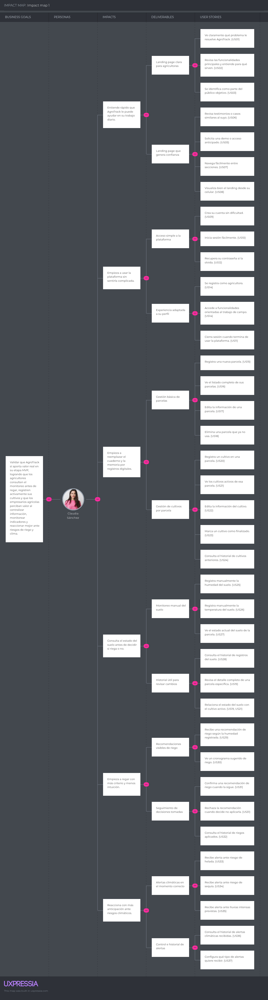

# Capítulo III: Requirements Specification

## 3.1. User Stories

| **Épica** | **Título** |
|-----------|------------|
| EP01 | Landing Page |
| EP02 | Autenticación y Gestión de Cuenta |
| EP03 | Gestión de Parcelas |
| EP04 | Gestión de Cultivos |
| EP05 | Monitoreo y Registro de Datos del Suelo |
| EP06 | Recomendaciones de Riego |
| EP07 | Alertas Climáticas |
| EP08 | Dashboard y Reportes |
| EP09 | RESTful API - Autenticación |
| EP10 | RESTful API - Parcelas |
| EP11 | RESTful API - Cultivos |
| EP12 | RESTful API - Suelo |
| EP13 | RESTful API - Alertas Climáticas |
| EP14 | RESTful API - Recomendaciones de Riego |

 
 

| Epic / Story ID | Título | Descripción | Criterios de Aceptación | Relacionado con (Epic ID) |
|-----------------|--------|-------------|-------------------------|---------------------------|
| EP01 / US01 | Ver propuesta de valor de AgroTrack | Como visitante, quiero ver claramente qué problema resuelve AgroTrack, para entender si la plataforma es útil para mí. | **Escenario 1: Visitante ve la propuesta de valor**   **Given** el visitante ingresa al landing page,   **When** la página carga correctamente,   **Then** se muestra una sección principal con el problema que resuelve AgroTrack y un botón de llamada a la acción. | EP01 |
| EP01 / US02 | Ver sección de funcionalidades principales | Como visitante, quiero ver las funcionalidades que ofrece AgroTrack, para evaluar si cubre mis necesidades como agricultor o empresario. | **Escenario 1: Visitante visualiza las funcionalidades**   **Given** el visitante está en el landing page,   **When** navega hacia la sección de funcionalidades,   **Then** se muestran al menos 4 funcionalidades con ícono, título y descripción breve cada una. | EP01 |
| EP01 / US03 | Ver los segmentos objetivo a los que va dirigido | Como visitante, quiero saber a quiénes va dirigida la plataforma, para identificar si pertenezco al público objetivo. | **Escenario 1: Visitante identifica su segmento**   **Given** el visitante está en el landing page,   **When** llega a la sección de segmentos,   **Then** se muestran los dos perfiles (Agricultor y Empresario Agrícola) con una descripción clara de cada uno. | EP01 |
| EP01 / US04 | Ver planes y precios disponibles | Como visitante, quiero conocer los planes y precios de AgroTrack, para decidir si puedo pagarlo. | **Escenario 1: Visitante revisa los planes disponibles**   **Given** el visitante está en el landing page,   **When** navega a la sección de precios,   **Then** se muestran los planes disponibles con sus funcionalidades y precio. | EP01 |
| EP01 / US05 | Solicitar demo o acceso anticipado | Como visitante interesado, quiero dejar mis datos para solicitar una demo, para probar la plataforma antes de registrarme formalmente. | **Escenario 1: Visitante envía solicitud de demo exitosamente**   **Given** el visitante completa el formulario de demo con nombre y correo válidos,   **When** envía el formulario   **Then** se muestra un mensaje de confirmación indicando que su solicitud fue recibida.    **Escenario 2: Visitante intenta enviar el formulario vacío**   **Given** el visitante no completa los campos del formulario,   **When** presiona el botón de enviar,   **Then** se muestran mensajes de error indicando los campos obligatorios. | EP01 |
| EP01 / US06 | Ver testimonios o casos de uso reales | Como visitante, quiero leer experiencias de otros usuarios, para ganar confianza en la plataforma antes de registrarme. | **Escenario 1: Visitante visualiza los testimonios**   **Given** el visitante está en el landing page,   **When** llega a la sección de testimonios,   **Then** se muestran al menos 2 testimonios con nombre, perfil y comentario del usuario. | EP01 |
| EP01 / US07 | Navegar desde un menú fijo de secciones | Como visitante, quiero un menú de navegación siempre visible, para acceder rápidamente a cualquier sección del landing page. | **Escenario 1: Visitante navega usando el menú fijo**   **Given** el visitante está en cualquier parte del landing page,   **When** hace clic en una opción del menú,   **Then** la página hace scroll automático hacia la sección correspondiente.    **Escenario 2: El menú permanece visible al hacer scroll**   **Given** el visitante está haciendo scroll en la página,   **When** baja por el contenido,   **Then** el menú de navegación permanece fijo en la parte superior. | EP01 |
| EP01 / US08 | Visualizar el landing page desde cualquier dispositivo | Como visitante, quiero que el landing page se adapte a mi celular o tablet, para poder verlo bien desde cualquier dispositivo. | **Escenario 1: Visitante accede desde un celular**   **Given** el visitante abre el landing page desde un dispositivo móvil,   **When** la página carga,   **Then** el contenido se reorganiza correctamente sin elementos cortados ni scroll horizontal.    **Escenario 2: Visitante accede desde una tablet**   **Given** el visitante abre el landing page desde una tablet,   **When** la página carga,   **Then** el diseño se adapta correctamente al tamaño de pantalla. | EP01 |
| EP02 / US09 | Registrar una cuenta nueva | Como usuario nuevo, quiero crear una cuenta en AgroTrack, para acceder a todas las funcionalidades de la plataforma. | **Escenario 1: Usuario se registra exitosamente**   **Given** el usuario completa todos los campos del formulario con datos válidos,   **When** presiona el botón de registrarse,   **Then** se crea su cuenta y es redirigido al dashboard principal.    **Escenario 2: Correo ya existente**   **Given** el usuario ingresa un correo que ya está registrado,   **When** presiona el botón de registrarse,   **Then** se muestra un mensaje de error indicando que el correo ya está en uso.    **Escenario 3: Campos obligatorios vacíos**   **Given** el usuario no completa todos los campos requeridos,   **When** presiona el botón de registrarse,   **Then** se resaltan los campos vacíos con un mensaje de error. | EP02 |
| EP02 / US10 | Iniciar sesión con correo y contraseña | Como usuario registrado, quiero iniciar sesión con mi correo y contraseña, para acceder a mi cuenta y mis datos. | **Escenario 1: Usuario inicia sesión correctamente**   **Given** el usuario ingresa un correo y contraseña válidos,   **When** presiona el botón de iniciar sesión,   **Then** es redirigido a su dashboard principal.    **Escenario 2: Credenciales incorrectas**   **Given** el usuario ingresa un correo o contraseña incorrectos,   **When** presiona el botón de iniciar sesión,   **Then** se muestra un mensaje de error indicando que las credenciales son inválidas. | EP02 |
| EP02 / US11 | Cerrar sesión | Como usuario autenticado, quiero cerrar sesión, para proteger mi cuenta cuando dejo de usar la plataforma. | **Escenario 1: Usuario cierra sesión exitosamente**   **Given** el usuario está autenticado en la plataforma,   **When** presiona la opción de cerrar sesión,   **Then** su sesión termina y es redirigido a la página de inicio de sesión. | EP02 |
| EP02 / US12 | Recuperar contraseña olvidada | Como usuario, quiero recuperar mi contraseña si la olvidé, para volver a acceder a mi cuenta sin perder mis datos. | **Escenario 1: Recuperación con correo válido**   **Given** el usuario ingresa un correo registrado en el formulario de recuperación,   **When** presiona el botón de enviar,   **Then** se muestra un mensaje indicando que recibirá instrucciones en su correo.    **Escenario 2: Correo no registrado**   **Given** el usuario ingresa un correo que no existe en el sistema,   **When** presiona el botón de enviar,   **Then** se muestra un mensaje de error indicando que el correo no está registrado. | EP02 |
| EP02 / US13 | Editar datos del perfil personal | Como usuario registrado, quiero editar mi información de perfil, para mantener mis datos actualizados. | **Escenario 1: Usuario actualiza su perfil correctamente**   **Given** el usuario modifica uno o más campos de su perfil con datos válidos,   **When** presiona el botón de guardar cambios,   **Then** los datos se actualizan y se muestra un mensaje de confirmación.    **Escenario 2: Campos obligatorios vacíos**   **Given** el usuario borra un campo obligatorio de su perfil,   **When** presiona el botón de guardar cambios,   **Then** se muestra un mensaje de error indicando los campos requeridos. | EP02 |
| EP02 / US14 | Seleccionar tipo de usuario al registrarse (Agricultor o Empresario Agrícola) | Como usuario nuevo, quiero elegir si soy Agricultor o Empresario Agrícola al registrarme, para que la plataforma me muestre las funcionalidades que corresponden a mi perfil. | **Escenario 1: Usuario selecciona el tipo Agricultor**   **Given** el usuario está en el formulario de registro,   **When** selecciona el tipo "Agricultor" y completa el registro,   **Then** accede a un dashboard con funcionalidades orientadas al agricultor.    **Escenario 2: Usuario selecciona el tipo Empresario Agrícola**   **Given** el usuario está en el formulario de registro,   **When** selecciona el tipo "Empresario Agrícola" y completa el registro,   **Then** accede a un dashboard con funcionalidades de gestión empresarial y métricas. | EP02 |
| EP03 / US15 | Registrar una nueva parcela | Como agricultor, quiero registrar una nueva parcela en la plataforma, para comenzar a hacer seguimiento de mis cultivos en ese terreno. | **Escenario 1: Parcela registrada exitosamente**   **Given** el agricultor completa el formulario con nombre, ubicación y tamaño de la parcela,   **When** presiona el botón de guardar,   **Then** la parcela queda registrada y aparece en su listado.    **Escenario 2: Nombre de parcela vacío**   **Given** el agricultor deja el campo nombre vacío,   **When** presiona el botón de guardar,   **Then** se muestra un mensaje de error indicando que el nombre es obligatorio. | EP03 |
| EP03 / US16 | Ver listado de mis parcelas | Como agricultor, quiero ver todas mis parcelas registradas en un solo lugar, para tener una vista general de mis terrenos. | **Escenario 1: Agricultor visualiza su listado de parcelas**   **Given** el agricultor tiene al menos una parcela registrada,   **When** accede a la sección de parcelas,   **Then** se muestran todas sus parcelas con nombre, ubicación y estado actual.    **Escenario 2: Sin parcelas registradas**   **Given** el agricultor no ha registrado ninguna parcela,   **When** accede a la sección de parcelas,   **Then** se muestra un mensaje indicando que no tiene parcelas y un botón para crear la primera. | EP03 |
| EP03 / US17 | Editar información de una parcela | Como agricultor, quiero editar los datos de una parcela, para corregir o actualizar su información cuando sea necesario. | **Escenario 1: Parcela editada exitosamente**   **Given** el agricultor selecciona una parcela y modifica sus datos con información válida,   **When** presiona el botón de guardar cambios,   **Then** los datos actualizados se guardan y se muestra un mensaje de confirmación. | EP03 |
| EP03 / US18 | Eliminar una parcela registrada | Como agricultor, quiero eliminar una parcela que ya no uso, para mantener mi listado limpio y organizado. | **Escenario 1: Parcela eliminada exitosamente**   **Given** el agricultor selecciona la opción de eliminar en una parcela,   **When** confirma la acción en el mensaje de advertencia,   **Then** la parcela desaparece del listado permanentemente.    **Escenario 2: Agricultor cancela la eliminación**   **Given** el agricultor selecciona la opción de eliminar en una parcela,   **When** cancela la acción en el mensaje de advertencia,   **Then** la parcela se mantiene en el listado sin cambios. | EP03 |
| EP03 / US19 | Ver detalle de una parcela específica | Como agricultor, quiero ver el detalle completo de una parcela, para revisar toda su información y el estado de sus cultivos. | **Escenario 1: Agricultor accede al detalle de una parcela**   **Given** el agricultor selecciona una parcela de su listado,   **When** la página de detalle carga,   **Then** se muestra la información completa de la parcela junto con sus cultivos activos y el estado del suelo. | EP03 |
| EP04 / US20 | Registrar un cultivo en una parcela | Como agricultor, quiero registrar un nuevo cultivo en una de mis parcelas, para llevar un control digital de lo que estoy sembrando. | **Escenario 1: Cultivo registrado exitosamente**   **Given** el agricultor selecciona una parcela y completa el formulario con tipo de cultivo y fecha de siembra,   **When** presiona el botón de guardar,   **Then** el cultivo queda registrado y aparece en el detalle de la parcela.    **Escenario 2: Campo tipo de cultivo vacío**   **Given** el agricultor deja el campo tipo de cultivo vacío,   **When** presiona el botón de guardar,   **Then** se muestra un mensaje de error indicando que el campo es obligatorio. | EP04 |
| EP04 / US21 | Ver los cultivos activos de una parcela | Como agricultor, quiero ver los cultivos activos de una parcela, para saber qué estoy cultivando actualmente en ese terreno. | **Escenario 1: Agricultor visualiza cultivos activos**   **Given** el agricultor tiene al menos un cultivo activo en una parcela,   **When** accede al detalle de esa parcela,   **Then** se muestran todos los cultivos activos con su tipo, fecha de siembra y estado.    **Escenario 2: Parcela sin cultivos activos**   **Given** la parcela no tiene cultivos activos registrados,   **When** el agricultor accede a su detalle,   **Then** se muestra un mensaje indicando que no hay cultivos activos y un botón para agregar uno. | EP04 |
| EP04 / US22 | Editar información de un cultivo | Como agricultor, quiero editar los datos de un cultivo registrado, para corregir errores o actualizar su información. | **Escenario 1: Cultivo editado exitosamente**   **Given** el agricultor selecciona un cultivo y modifica sus datos con información válida,   **When** presiona guardar cambios,   **Then** los nuevos datos quedan guardados y se muestra un mensaje de confirmación. | EP04 |
| EP04 / US23 | Marcar un cultivo como cosechado o finalizado | Como agricultor, quiero marcar un cultivo como finalizado, para registrar que ese ciclo de siembra ya terminó. | **Escenario 1: Cultivo finalizado exitosamente**   **Given** el agricultor selecciona un cultivo activo y elige la opción de marcar como cosechado,   **When** confirma la acción,   **Then** el cultivo cambia su estado a "Finalizado" y se mueve al historial de la parcela.    **Escenario 2: Cultivo ya finalizado**   **Given** el agricultor accede a un cultivo con estado "Finalizado",   **When** revisa sus opciones,   **Then** la opción de marcar como cosechado no está disponible. | EP04 |
| EP04 / US24 | Ver historial de cultivos anteriores por parcela | Como agricultor, quiero ver el historial de cultivos pasados de una parcela, para analizar qué sembré en temporadas anteriores y qué resultados tuve. | **Escenario 1: Agricultor revisa el historial de cultivos**   **Given** el agricultor tiene al menos un cultivo finalizado en una parcela,   **When** accede a la sección de historial de esa parcela,   **Then** se muestran los cultivos finalizados con su tipo, fecha de siembra y fecha de cosecha. | EP04 |
| EP05 / US25 | Ingresar manualmente datos de humedad del suelo | Como agricultor, quiero registrar manualmente el nivel de humedad del suelo de mi parcela, para que la plataforma pueda darme recomendaciones basadas en datos reales. | **Escenario 1: Humedad registrada exitosamente**   **Given** el agricultor ingresa un valor numérico de humedad entre 0 y 100,   **When** presiona el botón de guardar registro,   **Then** el dato queda almacenado con la fecha y hora del registro.    **Escenario 2: Valor fuera del rango permitido**   **Given** el agricultor ingresa un valor menor a 0 o mayor a 100,   **When** presiona el botón de guardar registro,   **Then** se muestra un mensaje de error indicando que el valor debe estar entre 0 y 100. | EP05 |
| EP05 / US26 | Ingresar manualmente datos de temperatura del suelo | Como agricultor, quiero registrar la temperatura del suelo de mi parcela, para tener un historial de condiciones del terreno. | **Escenario 1: Temperatura registrada exitosamente**   **Given** el agricultor ingresa un valor numérico de temperatura válido,   **When** presiona el botón de guardar registro,   **Then** el dato queda almacenado con la fecha y hora del registro.    **Escenario 2: Valor no numérico**   **Given** el agricultor ingresa letras o caracteres especiales en el campo de temperatura,   **When** presiona el botón de guardar registro,   **Then** se muestra un mensaje de error indicando que el valor debe ser numérico. | EP05 |
| EP05 / US27 | Ver el estado actual del suelo de una parcela | Como agricultor, quiero ver el estado actual del suelo de mi parcela, para saber si necesita riego o está en condiciones adecuadas. | **Escenario 1: Agricultor visualiza el estado actual del suelo**   **Given** el agricultor tiene al menos un registro de suelo en su parcela,   **When** accede al detalle de esa parcela,   **Then** se muestra el último valor de humedad y temperatura registrados junto con un indicador visual de estado (bajo, normal, alto).    **Escenario 2: Sin registros de suelo**   **Given** la parcela no tiene registros de suelo,   **When** el agricultor accede a su detalle,   **Then** se muestra un mensaje indicando que aún no hay datos del suelo registrados. | EP05 |
| EP05 / US28 | Ver historial de registros del suelo por parcela | Como agricultor, quiero ver el historial de datos del suelo de una parcela, para identificar cómo han variado las condiciones con el tiempo. | **Escenario 1: Agricultor revisa el historial del suelo**   **Given** el agricultor tiene múltiples registros de suelo en una parcela,   **When** accede a la sección de historial del suelo,   **Then** se muestran los registros ordenados del más reciente al más antiguo con fecha, humedad y temperatura. | EP05 |
| EP06 / US29 | Recibir recomendación de riego basada en datos del suelo | Como agricultor, quiero recibir una recomendación de riego según el nivel de humedad registrado, para tomar decisiones más informadas y no basarme solo en mi intuición. | **Escenario 1: Humedad baja genera recomendación de riego**   **Given** el agricultor registra un nivel de humedad menor al 40%,   **When** el sistema procesa el dato,   **Then** se muestra una recomendación indicando que la parcela necesita riego.    **Escenario 2: Humedad normal sin recomendación**   **Given** el agricultor registra un nivel de humedad entre 40% y 70%,   **When** el sistema procesa el dato,   **Then** se muestra un mensaje indicando que la parcela está en condiciones adecuadas.    **Escenario 3: Humedad alta genera advertencia**   **Given** el agricultor registra un nivel de humedad mayor al 70%,   **When** el sistema procesa el dato,   **Then** se muestra una advertencia indicando que el suelo tiene exceso de humedad y no debe regarse. | EP06 |
| EP06 / US30 | Ver el cronograma de riego sugerido por la plataforma | Como agricultor, quiero ver un cronograma de riego recomendado para mi parcela, para planificar mis actividades de riego con anticipación. | **Escenario 1: Agricultor visualiza el cronograma de riego**   **Given** el agricultor accede a la sección de cronograma de riego de una parcela,   **When** la sección carga,   **Then** se muestra una lista de fechas y horarios sugeridos de riego basados en los datos del suelo registrados. | EP06 |
| EP06 / US31 | Confirmar o rechazar una recomendación de riego | Como agricultor, quiero poder confirmar o rechazar una recomendación de riego, para registrar si seguí o no el consejo de la plataforma. | **Escenario 1: Agricultor confirma una recomendación**   **Given** el agricultor recibe una recomendación de riego,   **When** presiona el botón de confirmar,   **Then** la recomendación queda registrada como aplicada en el historial.    **Escenario 2: Agricultor rechaza una recomendación**   **Given** el agricultor recibe una recomendación de riego,   **When** presiona el botón de rechazar,   **Then** la recomendación queda registrada como no aplicada en el historial. | EP06 |
| EP06 / US32 | Ver historial de riegos aplicados en una parcela | Como agricultor, quiero ver el historial de riegos que apliqué en una parcela, para revisar con qué frecuencia regué y si seguí las recomendaciones. | **Escenario 1: Agricultor revisa su historial de riegos**   **Given** el agricultor tiene al menos un riego confirmado en una parcela,   **When** accede a la sección de historial de riegos,   **Then** se muestran los registros con fecha, hora y si la recomendación fue seguida o no. | EP06 |
| EP07 / US33 | Recibir alerta ante riesgo de helada | Como agricultor, quiero recibir una alerta cuando se pronostique una helada en mi zona, para proteger mis cultivos con anticipación. | **Escenario 1: Sistema detecta riesgo de helada**   **Given** el sistema obtiene un pronóstico de temperatura menor a 0°C en la zona de una parcela,   **When** se procesa la alerta,   **Then** se muestra una notificación visible en el dashboard indicando el riesgo de helada y la fecha estimada.    **Escenario 2: Sin riesgo de helada**   **Given** el pronóstico de temperatura en la zona es mayor a 0°C,   **When** el sistema revisa las condiciones,   **Then** no se genera ninguna alerta de helada. | EP07 |
| EP07 / US34 | Recibir alerta ante riesgo de sequía | Como agricultor, quiero recibir una alerta cuando se pronostique un período de sequía prolongada, para anticipar mis decisiones de riego. | **Escenario 1: Sistema detecta riesgo de sequía**   **Given** el sistema detecta un pronóstico de ausencia de lluvias por más de 7 días consecutivos,   **When** se procesa la alerta,   **Then** se muestra una notificación en el dashboard indicando el riesgo de sequía y los días proyectados sin lluvia. | EP07 |
| EP07 / US35 | Recibir alerta ante lluvias intensas previstas | Como agricultor, quiero recibir una alerta cuando se esperen lluvias intensas, para evitar el exceso de riego y proteger mis cultivos. | **Escenario 1: Sistema detecta lluvia intensa**   **Given** el pronóstico indica precipitaciones intensas en la zona de la parcela,   **When** el sistema procesa la alerta,   **Then** se muestra una notificación en el dashboard indicando la lluvia esperada y recomendando pausar el riego. | EP07 |
| EP07 / US36 | Ver historial de alertas climáticas recibidas | Como agricultor, quiero ver todas las alertas climáticas que recibí, para revisar qué eventos ocurrieron y cómo respondí ante ellos. | **Escenario 1: Agricultor revisa su historial de alertas**   **Given** el agricultor tiene al menos una alerta registrada,   **When** accede a la sección de historial de alertas,   **Then** se muestran las alertas ordenadas por fecha con tipo de alerta y descripción.    **Escenario 2: Sin alertas registradas**   **Given** el agricultor no tiene alertas registradas,   **When** accede al historial de alertas,   **Then** se muestra un mensaje indicando que no hay alertas registradas hasta el momento. | EP07 |
| EP07 / US37 | Configurar qué tipo de alertas quiero recibir | Como agricultor, quiero elegir qué tipos de alertas climáticas quiero recibir, para no saturarme de notificaciones que no me sean útiles. | **Escenario 1: Agricultor activa un tipo de alerta**   **Given** el agricultor accede a la configuración de alertas,   **When** activa la opción de un tipo de alerta específico,   **Then** ese tipo de alerta queda habilitado y el sistema lo incluirá en las notificaciones futuras.    **Escenario 2: Agricultor desactiva un tipo de alerta**   **Given** el agricultor accede a la configuración de alertas,   **When** desactiva la opción de un tipo de alerta específico,   **Then** ese tipo de alerta queda deshabilitado y el sistema dejará de generarla. | EP07 |
| EP08 / US38 | Ver panel de control con resumen de todas mis parcelas | Como empresario agrícola, quiero ver un panel de control con el estado de todas mis parcelas, para tener visibilidad centralizada de mi operación sin depender de reportes manuales. | **Escenario 1: Empresario visualiza el panel con parcelas**   **Given** el empresario tiene al menos una parcela registrada,   **When** accede a su dashboard principal,   **Then** se muestra un resumen de cada parcela con su estado actual de humedad, cultivo activo y última alerta recibida.    **Escenario 2: Empresario sin parcelas registradas**   **Given** el empresario no tiene parcelas registradas,   **When** accede a su dashboard principal,   **Then** se muestra un mensaje invitándolo a registrar su primera parcela. | EP08 |
| EP08 / US39 | Ver rendimiento por parcela | Como empresario agrícola, quiero ver el rendimiento de cada parcela, para identificar cuáles están siendo más productivas y tomar decisiones de inversión. | **Escenario 1: Empresario visualiza el rendimiento de sus parcelas**   **Given** el empresario tiene cultivos finalizados con datos registrados,   **When** accede a la sección de rendimiento,   **Then** se muestran métricas de producción por parcela ordenadas de mayor a menor rendimiento. | EP08 |
| EP08 / US40 | Ver porcentaje de pérdidas estimadas por parcela | Como empresario agrícola, quiero ver el porcentaje de pérdidas estimadas por parcela, para identificar dónde estoy perdiendo más y tomar acciones correctivas. | **Escenario 1: Empresario visualiza las pérdidas estimadas**   **Given** el empresario tiene registros de producción en sus parcelas,   **When** accede a la sección de pérdidas,   **Then** se muestra el porcentaje de pérdidas estimado por parcela junto con las causas registradas. | EP08 |
| EP08 / US41 | Ver consumo de agua registrado por temporada | Como empresario agrícola, quiero ver cuánta agua se ha consumido por temporada en cada parcela, para evaluar la eficiencia del riego y reducir costos operativos. | **Escenario 1: Empresario revisa el consumo de agua**   **Given** el empresario tiene registros de riego en sus parcelas,   **When** accede a la sección de consumo de agua,   **Then** se muestra el consumo total de agua por parcela agrupado por temporada. | EP08 |
| EP08 / US42 | Exportar reporte de producción en formato PDF o Excel | Como empresario agrícola, quiero exportar un reporte de producción de mis parcelas, para compartirlo con mi equipo o analizarlo fuera de la plataforma. | **Escenario 1: Exportación en PDF exitosa**   **Given** el empresario accede a la sección de reportes y selecciona el formato PDF,   **When** presiona el botón de exportar,   **Then** se descarga un archivo PDF con el resumen de producción de sus parcelas.    **Escenario 2: Exportación en Excel exitosa**   **Given** el empresario accede a la sección de reportes y selecciona el formato Excel,   **When** presiona el botón de exportar,   **Then** se descarga un archivo Excel con los datos de producción organizados por parcela y temporada.    **Escenario 3: Sin datos para exportar**   **Given** el empresario no tiene registros de producción,   **When** intenta exportar el reporte,   **Then** se muestra un mensaje indicando que no hay datos disponibles para generar el reporte. | EP08 |
| EP10 / TS01 | Endpoint de registro de usuario | Como developer, quiero un endpoint POST para registrar usuarios, para que el frontend pueda crear nuevas cuentas desde el formulario de registro. | **Escenario 1: Registro exitoso**   **Given** el developer envía una solicitud POST con datos válidos de usuario,   **When** el servidor procesa la solicitud,   **Then** responde con status 201 y el objeto del usuario creado sin incluir la contraseña.    **Escenario 2: Correo ya registrado**   **Given** el developer envía una solicitud POST con un correo ya existente,   **When** el servidor procesa la solicitud,   **Then** responde con status 400 y un mensaje indicando que el correo ya está en uso.    **Escenario 3: Campos obligatorios faltantes**   **Given** el developer envía una solicitud POST con campos requeridos vacíos,   **When** el servidor procesa la solicitud,   **Then** responde con status 400 y un mensaje indicando los campos faltantes. | EP10 |
| EP10 / TS02 | Endpoint de inicio de sesión | Como developer, quiero un endpoint POST para autenticar usuarios, para que el frontend pueda iniciar sesión y recibir un token de acceso. | **Escenario 1: Login exitoso**   **Given** el developer envía credenciales válidas,   **When** el servidor las valida,   **Then** responde con status 200 y un token JWT junto con los datos básicos del usuario.    **Escenario 2: Credenciales incorrectas**   **Given** el developer envía credenciales inválidas,   **When** el servidor las valida,   **Then** responde con status 401 y un mensaje indicando que las credenciales son incorrectas. | EP10 |
| EP11 / TS03 | Endpoint para crear una parcela | Como developer, quiero un endpoint POST para registrar parcelas, para que el frontend pueda guardar nuevas parcelas vinculadas a un usuario. | **Escenario 1: Parcela creada exitosamente**   **Given** el developer envía una solicitud POST con datos válidos de parcela,   **When** el servidor procesa la solicitud,   **Then** responde con status 201 y el objeto de la parcela creada con su ID generado.    **Escenario 2: Datos incompletos**   **Given** el developer envía una solicitud POST sin el campo nombre,   **When** el servidor procesa la solicitud,   **Then** responde con status 400 y un mensaje indicando los campos requeridos. | EP11 |
| EP11 / TS04 | Endpoint para obtener parcelas de un usuario | Como developer, quiero un endpoint GET para obtener todas las parcelas de un usuario, para que el frontend pueda mostrar el listado de parcelas en el dashboard. | **Escenario 1: Usuario tiene parcelas registradas**   **Given** el developer envía una solicitud GET con un userId válido,   **When** el servidor procesa la solicitud,   **Then** responde con status 200 y un array con todas las parcelas del usuario.    **Escenario 2: Usuario sin parcelas**   **Given** el developer envía una solicitud GET con un userId que no tiene parcelas,   **When** el servidor procesa la solicitud,   **Then** responde con status 200 y un array vacío.    **Escenario 3: userId no existe**   **Given** el developer envía una solicitud GET con un userId inexistente,   **When** el servidor procesa la solicitud,   **Then** responde con status 404 y un mensaje indicando que el usuario no fue encontrado. | EP11 |
| EP11 / TS05 | Endpoint para actualizar una parcela | Como developer, quiero un endpoint PUT para actualizar los datos de una parcela, para que el frontend pueda guardar los cambios realizados por el usuario. | **Escenario 1: Actualización exitosa**   **Given** el developer envía una solicitud PUT con un ID de parcela válido y datos correctos,   **When** el servidor procesa la solicitud,   **Then** responde con status 200 y el objeto de la parcela con los datos actualizados.    **Escenario 2: Parcela no encontrada**   **Given** el developer envía una solicitud PUT con un ID de parcela que no existe,   **When** el servidor procesa la solicitud,   **Then** responde con status 404 y un mensaje indicando que la parcela no fue encontrada. | EP11 |
| EP11 / TS06 | Endpoint para eliminar una parcela | Como developer, quiero un endpoint DELETE para eliminar una parcela, para que el frontend pueda removerla cuando el usuario lo solicite. | **Escenario 1: Eliminación exitosa**   **Given** el developer envía una solicitud DELETE con un ID de parcela válido,   **When** el servidor procesa la solicitud,   **Then** responde con status 200 y un mensaje confirmando que la parcela fue eliminada.    **Escenario 2: Parcela no encontrada**   **Given** el developer envía una solicitud DELETE con un ID inexistente,   **When** el servidor procesa la solicitud,   **Then** responde con status 404 y un mensaje indicando que la parcela no fue encontrada. | EP11 |
| EP12 / TS07 | Endpoint para crear un cultivo | Como developer, quiero un endpoint POST para registrar cultivos en una parcela, para que el frontend pueda guardar la información de siembra del agricultor. | **Escenario 1: Cultivo creado exitosamente**   **Given** el developer envía una solicitud POST con datos válidos de cultivo,   **When** el servidor procesa la solicitud,   **Then** responde con status 201 y el objeto del cultivo creado con su ID.    **Escenario 2: plotId no existe**   **Given** el developer envía una solicitud POST con un plotId inexistente,   **When** el servidor procesa la solicitud,   **Then** responde con status 404 y un mensaje indicando que la parcela asociada no existe. | EP12 |
| EP12 / TS08 | Endpoint para obtener cultivos de una parcela | Como developer, quiero un endpoint GET para obtener todos los cultivos de una parcela, para que el frontend pueda mostrarlos en el detalle de la parcela. | **Escenario 1: Parcela tiene cultivos registrados**   **Given** el developer envía una solicitud GET con un plotId válido,   **When** el servidor procesa la solicitud,   **Then** responde con status 200 y un array con todos los cultivos de esa parcela.    **Escenario 2: Parcela sin cultivos**   **Given** el developer envía una solicitud GET con un plotId sin cultivos asociados,   **When** el servidor procesa la solicitud,   **Then** responde con status 200 y un array vacío. | EP12 |
| EP12 / TS09 | Endpoint para actualizar el estado de un cultivo | Como developer, quiero un endpoint PATCH para actualizar el estado de un cultivo, para que el frontend pueda marcarlo como finalizado cuando el agricultor coseche. | **Escenario 1: Estado actualizado exitosamente**   **Given** el developer envía una solicitud PATCH con un ID de cultivo válido y un estado permitido,   **When** el servidor procesa la solicitud,   **Then** responde con status 200 y el objeto del cultivo con el estado actualizado.     | EP12 |
| EP13 / TS10 | Endpoint para registrar datos del suelo | Como developer, quiero un endpoint POST para registrar datos de humedad y temperatura del suelo, para que el frontend pueda guardar los registros manuales del agricultor. | **Escenario 1: Registro guardado exitosamente**   **Given** el developer envía una solicitud POST con valores válidos de humedad y temperatura,   **When** el servidor procesa la solicitud,   **Then** responde con status 201 y el objeto del registro con su ID y timestamp.    **Escenario 2: Humedad fuera de rango**   **Given** el developer envía un valor de humedad menor a 0 o mayor a 100,   **When** el servidor procesa la solicitud,   **Then** responde con status 400 y un mensaje indicando que el valor de humedad debe estar entre 0 y 100. | EP13 |
| EP13 / TS11 | Endpoint para obtener historial de datos del suelo | Como developer, quiero un endpoint GET para obtener el historial de registros del suelo de una parcela, para que el frontend pueda mostrarlo al agricultor. | **Escenario 1: Historial obtenido exitosamente**   **Given** el developer envía una solicitud GET con un plotId válido,   **When** el servidor procesa la solicitud,   **Then** responde con status 200 y un array con los registros ordenados del más reciente al más antiguo.    **Escenario 2: Sin registros de suelo**   **Given** el developer envía una solicitud GET con un plotId sin registros,   **When** el servidor procesa la solicitud,   **Then** responde con status 200 y un array vacío. | EP13 |
| EP14 / TS12 | Endpoint para obtener alertas climáticas de una parcela | Como developer, quiero un endpoint GET para obtener las alertas climáticas activas de una parcela, para que el frontend pueda mostrarlas en el dashboard del agricultor. | **Escenario 1: Alertas encontradas**   **Given** el developer envía una solicitud GET con un plotId que tiene alertas activas,   **When** el servidor procesa la solicitud,   **Then** responde con status 200 y un array con las alertas activas indicando tipo, descripción y fecha.    **Escenario 2: Sin alertas activas**   **Given** el developer envía una solicitud GET con un plotId sin alertas,   **When** el servidor procesa la solicitud,   **Then** responde con status 200 y un array vacío. | EP14 |
| EP14 / TS13 | Endpoint para crear una alerta climática | Como developer, quiero un endpoint POST para registrar una alerta climática en una parcela, para que el sistema pueda generarlas automáticamente al procesar datos del clima. | **Escenario 1: Alerta creada exitosamente**   **Given** el developer envía una solicitud POST con un tipo de alerta válido y un plotId existente,   **When** el servidor procesa la solicitud,   **Then** responde con status 201 y el objeto de la alerta creada.    | EP14 |
| EP15 / TS14 | Endpoint para obtener recomendación de riego | Como developer, quiero un endpoint GET que retorne una recomendación de riego basada en el último registro del suelo de una parcela, para que el frontend pueda mostrarla al agricultor. | **Escenario 1: Recomendación por humedad baja**   **Given** el developer envía una solicitud GET y el último registro de humedad de la parcela es menor al 40%,   **When** el servidor procesa la solicitud,   **Then** responde con status 200 y un objeto indicando que se recomienda regar junto con el nivel de urgencia.    **Escenario 2: Sin necesidad de riego**   **Given** el developer envía una solicitud GET y el último registro de humedad está entre 40% y 70%,   **When** el servidor procesa la solicitud,   **Then** responde con status 200 y un objeto indicando que no es necesario regar actualmente.    **Escenario 3: Sin datos de suelo disponibles**   **Given** el developer envía una solicitud GET y la parcela no tiene registros de suelo,   **When** el servidor procesa la solicitud,   **Then** responde con status 404 y un mensaje indicando que no hay datos del suelo para generar una recomendación. | EP15 |
| EP15 / TS15 | Endpoint para registrar respuesta a una recomendación | Como developer, quiero un endpoint POST para registrar si el agricultor aceptó o rechazó una recomendación de riego, para que el historial quede guardado en el sistema. | **Escenario 1: Respuesta registrada exitosamente**   **Given** el developer envía una solicitud POST con un ID de recomendación válido y un valor booleano de aceptación,   **When** el servidor procesa la solicitud,   **Then** responde con status 201 y el objeto de la respuesta registrada.    **Escenario 2: Recomendación no encontrada**   **Given** el developer envía una solicitud POST con un ID de recomendación inexistente,   **When** el servidor procesa la solicitud,   **Then** responde con status 404 y un mensaje indicando que la recomendación no fue encontrada. | EP15 |

  

### 3.2. Impact Mapping

Este artefacto estratégico permite al equipo de Andes Smart asegurar que
cada funcionalidad del Product Backlog esté directamente vinculada a un
objetivo de negocio medible, evitando el desarrollo de características
que no aporten valor real al usuario final.

**Segmento Agricultor**

  

**Segmento Empresario Agricola**

  

## 3.3. Product Backlog

| # Orden | User Story Id | Título | Descripción | Story Points (1/2/3/5/8) |
|--------|---------------|--------|-------------|--------------------------|
| **1** | **US01** | Ver propuesta de valor de AgroTrack | Como visitante, quiero ver claramente qué problema resuelve AgroTrack, para entender si la plataforma es útil para mí. | **1** |
| **2** | **US02** | Ver sección de funcionalidades principales | Como visitante, quiero ver las funcionalidades que ofrece AgroTrack, para evaluar si cubre mis necesidades como agricultor o empresario. | **1** |
| **3** | **US03** | Ver los segmentos objetivo a los que va dirigido | Como visitante, quiero saber a quiénes va dirigida la plataforma, para identificar si pertenezco al público objetivo. | **1** |
| **4** | **US04** | Ver planes y precios disponibles | Como visitante, quiero conocer los planes y precios de AgroTrack, para decidir si puedo pagarlo. | **2** |
| **5** | **US05** | Solicitar demo o acceso anticipado | Como visitante interesado, quiero dejar mis datos para solicitar una demo, para probar la plataforma antes de registrarme formalmente. | **3** |
| **6** | **US06** | Ver testimonios o casos de uso reales | Como visitante, quiero leer experiencias de otros usuarios, para ganar confianza en la plataforma antes de registrarme. | **1** |
| **7** | **US07** | Navegar desde un menú fijo de secciones | Como visitante, quiero un menú de navegación siempre visible, para acceder rápidamente a cualquier sección del landing page. | **2** |
| **8** | **US08** | Visualizar el landing page desde cualquier dispositivo | Como visitante, quiero que el landing page se adapte a mi celular o tablet, para poder verlo bien desde cualquier dispositivo. | **3** |
| **9** | **US09** | Registrar una cuenta nueva | Como usuario nuevo, quiero crear una cuenta en AgroTrack, para acceder a todas las funcionalidades de la plataforma. | **3** |
| **10** | **US10** | Iniciar sesión con correo y contraseña | Como usuario registrado, quiero iniciar sesión con mi correo y contraseña, para acceder a mi cuenta y mis datos. | **3** |
| **11** | **US11** | Cerrar sesión | Como usuario autenticado, quiero cerrar sesión, para proteger mi cuenta cuando dejo de usar la plataforma. | **1** |
| **12** | **US12** | Recuperar contraseña olvidada | Como usuario, quiero recuperar mi contraseña si la olvidé, para volver a acceder a mi cuenta sin perder mis datos. | **3** |
| **13** | **US13** | Editar datos del perfil personal | Como usuario registrado, quiero editar mi información de perfil, para mantener mis datos actualizados. | **3** |
| **14** | **US14** | Seleccionar tipo de usuario al registrarse (Agricultor o Empresario Agrícola) | Como usuario nuevo, quiero elegir si soy Agricultor o Empresario Agrícola al registrarme, para que la plataforma me muestre las funcionalidades que corresponden a mi perfil. | **2** |
| **15** | **US15** | Registrar una nueva parcela | Como agricultor, quiero registrar una nueva parcela en la plataforma, para comenzar a hacer seguimiento de mis cultivos en ese terreno. | **3** |
| **16** | **US16** | Ver listado de mis parcelas | Como agricultor, quiero ver todas mis parcelas registradas en un solo lugar, para tener una vista general de mis terrenos. | **2** |
| **17** | **US17** | Editar información de una parcela | Como agricultor, quiero editar los datos de una parcela, para corregir o actualizar su información cuando sea necesario. | **3** |
| **18** | **US18** | Eliminar una parcela registrada | Como agricultor, quiero eliminar una parcela que ya no uso, para mantener mi listado limpio y organizado. | **2** |
| **19** | **US19** | Ver detalle de una parcela específica | Como agricultor, quiero ver el detalle completo de una parcela, para revisar toda su información y el estado de sus cultivos. | **3** |
| **20** | **US20** | Registrar un cultivo en una parcela | Como agricultor, quiero registrar un nuevo cultivo en una de mis parcelas, para llevar un control digital de lo que estoy sembrando. | **3** |
| **21** | **US21** | Ver los cultivos activos de una parcela | Como agricultor, quiero ver los cultivos activos de una parcela, para saber qué estoy cultivando actualmente en ese terreno. | **2** |
| **22** | **US22** | Editar información de un cultivo | Como agricultor, quiero editar los datos de un cultivo registrado, para corregir errores o actualizar su información. | **3** |
| **23** | **US23** | Marcar un cultivo como cosechado o finalizado | Como agricultor, quiero marcar un cultivo como finalizado, para registrar que ese ciclo de siembra ya terminó. | **3** |
| **24** | **US24** | Ver historial de cultivos anteriores por parcela | Como agricultor, quiero ver el historial de cultivos pasados de una parcela, para analizar qué sembré en temporadas anteriores y qué resultados tuve. | **2** |
| **25** | **US25** | Ingresar manualmente datos de humedad del suelo | Como agricultor, quiero registrar manualmente el nivel de humedad del suelo de mi parcela, para que la plataforma pueda darme recomendaciones basadas en datos reales. | **3** |
| **26** | **US26** | Ingresar manualmente datos de temperatura del suelo | Como agricultor, quiero registrar la temperatura del suelo de mi parcela, para tener un historial de condiciones del terreno. | **3** |
| **27** | **US27** | Ver el estado actual del suelo de una parcela | Como agricultor, quiero ver el estado actual del suelo de mi parcela, para saber si necesita riego o está en condiciones adecuadas. | **3** |
| **28** | **US28** | Ver historial de registros del suelo por parcela | Como agricultor, quiero ver el historial de datos del suelo de una parcela, para identificar cómo han variado las condiciones con el tiempo. | **2** |
| **29** | **US29** | Recibir recomendación de riego basada en datos del suelo | Como agricultor, quiero recibir una recomendación de riego según el nivel de humedad registrado, para tomar decisiones más informadas y no basarme solo en mi intuición. | **5** |
| **30** | **US30** | Ver el cronograma de riego sugerido por la plataforma | Como agricultor, quiero ver un cronograma de riego recomendado para mi parcela, para planificar mis actividades de riego con anticipación. | **5** |
| **31** | **US31** | Confirmar o rechazar una recomendación de riego | Como agricultor, quiero poder confirmar o rechazar una recomendación de riego, para registrar si seguí o no el consejo de la plataforma. | **3** |
| **32** | **US32** | Ver historial de riegos aplicados en una parcela | Como agricultor, quiero ver el historial de riegos que apliqué en una parcela, para revisar con qué frecuencia regué y si seguí las recomendaciones. | **2** |
| **33** | **US33** | Recibir alerta ante riesgo de helada | Como agricultor, quiero recibir una alerta cuando se pronostique una helada en mi zona, para proteger mis cultivos con anticipación. | **5** |
| **34** | **US34** | Recibir alerta ante riesgo de sequía | Como agricultor, quiero recibir una alerta cuando se pronostique un período de sequía prolongada, para anticipar mis decisiones de riego. | **5** |
| **35** | **US35** | Recibir alerta ante lluvias intensas previstas | Como agricultor, quiero recibir una alerta cuando se esperen lluvias intensas, para evitar el exceso de riego y proteger mis cultivos. | **5** |
| **36** | **US36** | Ver historial de alertas climáticas recibidas | Como agricultor, quiero ver todas las alertas climáticas que recibí, para revisar qué eventos ocurrieron y cómo respondí ante ellos. | **2** |
| **37** | **US37** | Configurar qué tipo de alertas quiero recibir | Como agricultor, quiero elegir qué tipos de alertas climáticas quiero recibir, para no saturarme de notificaciones que no me sean útiles. | **3** |
| **38** | **US38** | Ver panel de control con resumen de todas mis parcelas | Como empresario agrícola, quiero ver un panel de control con el estado de todas mis parcelas, para tener visibilidad centralizada de mi operación sin depender de reportes manuales. | **8** |
| **39** | **US39** | Ver rendimiento por parcela | Como empresario agrícola, quiero ver el rendimiento de cada parcela, para identificar cuáles están siendo más productivas y tomar decisiones de inversión. | **8** |
| **40** | **US40** | Ver porcentaje de pérdidas estimadas por parcela | Como empresario agrícola, quiero ver el porcentaje de pérdidas estimadas por parcela, para identificar dónde estoy perdiendo más y tomar acciones correctivas. | **8** |
| **41** | **US41** | Ver consumo de agua registrado por temporada | Como empresario agrícola, quiero ver cuánta agua se ha consumido por temporada en cada parcela, para evaluar la eficiencia del riego y reducir costos operativos. | **5** |
| **42** | **US42** | Exportar reporte de producción en formato PDF o Excel | Como empresario agrícola, quiero exportar un reporte de producción de mis parcelas, para compartirlo con mi equipo o analizarlo fuera de la plataforma. | **8** |

   

| # Orden | Technical Story Id | Título | Descripción | Story Points (1 / 2 / 3 / 5 / 8) |
|--------|--------------------|--------|-------------|----------------------------------|
| **1**| **TS01** | Endpoint de registro de usuario | Como developer, quiero un endpoint POST para registrar usuarios, para que el frontend pueda crear nuevas cuentas desde el formulario de registro. | **3** |
| **2**| **TS02** | Endpoint de inicio de sesión | Como developer, quiero un endpoint POST para autenticar usuarios, para que el frontend pueda iniciar sesión y recibir un token de acceso. | **3** |
| **3**| **TS03** | Endpoint para crear una parcela | Como developer, quiero un endpoint POST para registrar parcelas, para que el frontend pueda guardar nuevas parcelas vinculadas a un usuario. | **3** |
| **4**| **TS04** | Endpoint para obtener parcelas de un usuario | Como developer, quiero un endpoint GET para obtener todas las parcelas de un usuario, para que el frontend pueda mostrar el listado de parcelas en el dashboard. | **2** |
| **5**| **TS05** | Endpoint para actualizar una parcela | Como developer, quiero un endpoint PUT para actualizar los datos de una parcela, para que el frontend pueda guardar los cambios realizados por el usuario. | **3** |
| **6**| **TS06** | Endpoint para eliminar una parcela | Como developer, quiero un endpoint DELETE para eliminar una parcela, para que el frontend pueda removerla cuando el usuario lo solicite. | **2** |
| **7**| **TS07** | Endpoint para crear un cultivo | Como developer, quiero un endpoint POST para registrar cultivos en una parcela, para que el frontend pueda guardar la información de siembra del agricultor. | **3** |
| **8**| **TS08** | Endpoint para obtener cultivos de una parcela | Como developer, quiero un endpoint GET para obtener todos los cultivos de una parcela, para que el frontend pueda mostrarlos en el detalle de la parcela. | **2** |
| **9**| **TS09** | Endpoint para actualizar el estado de un cultivo | Como developer, quiero un endpoint PATCH para actualizar el estado de un cultivo, para que el frontend pueda marcarlo como finalizado cuando el agricultor coseche. | **2** |
| **10** | **TS10** | Endpoint para registrar datos del suelo | Como developer, quiero un endpoint POST para registrar datos de humedad y temperatura del suelo, para que el frontend pueda guardar los registros manuales del agricultor. | **3** |
| **11** | **TS11** | Endpoint para obtener historial de datos del suelo | Como developer, quiero un endpoint GET para obtener el historial de registros del suelo de una parcela, para que el frontend pueda mostrarlo al agricultor. | **2** |
| **12** | **TS12** | Endpoint para obtener alertas climáticas de una parcela | Como developer, quiero un endpoint GET para obtener las alertas climáticas activas de una parcela, para que el frontend pueda mostrarlas en el dashboard del agricultor. | **3** |
| **13** | **TS13** | Endpoint para crear una alerta climática | Como developer, quiero un endpoint POST para registrar una alerta climática en una parcela, para que el sistema pueda generarlas automáticamente al procesar datos del clima. | **3** |
| **14** | **TS14** | Endpoint para obtener recomendación de riego | Como developer, quiero un endpoint GET que retorne una recomendación de riego basada en el último registro del suelo de una parcela, para que el frontend pueda mostrarla al agricultor. | **5** |
| **15** | **TS15** | Endpoint para registrar respuesta a una recomendación | Como developer, quiero un endpoint POST para registrar si el agricultor aceptó o rechazó una recomendación de riego, para que el historial quede guardado en el sistema. | **3** |
